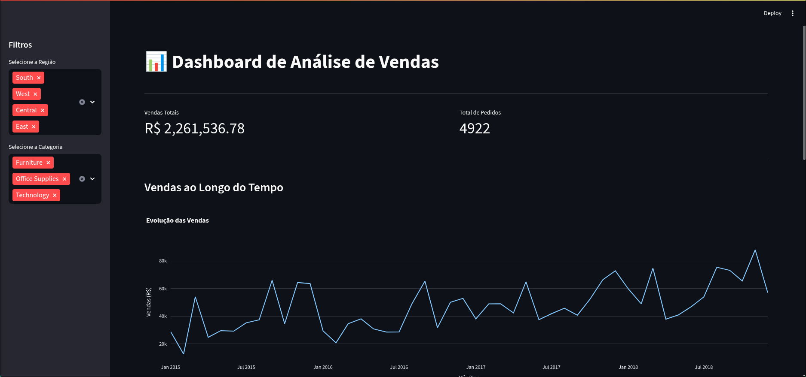

# 📊 Dashboard de Análise de Vendas

## Visão Geral
Este projeto é um dashboard interativo construído para analisar dados de vendas de uma rede de varejo global. O objetivo é fornecer insights rápidos sobre performance de vendas, permitindo a filtragem por região e categoria de produto.

## Arquitetura do Projeto
O projeto segue um fluxo de ETL (Extração, Transformação, Carga) para processar os dados e apresentá-los em uma aplicação web:

`Arquivo CSV` -> `Script Python (Pandas)` -> `Banco de Dados (PostgreSQL em Docker)` -> `Aplicação Web (Streamlit)`

## Tecnologias Utilizadas
- **Linguagem:** Python
- **Bibliotecas de Dados:** Pandas, SQLAlchemy
- **Banco de Dados:** PostgreSQL (rodando em um contêiner Docker)
- **Dashboard:** Streamlit, Plotly Express
- **Versionamento:** Git & GitHub

## Como Executar o Projeto
1.  Clone o repositório: `git clone https://github.com/renancmd/dashboard-de-vendas.git`
2.  Crie e ative um ambiente virtual: `python -m venv venv` e `source venv/bin/activate`
3.  Instale as dependências: `pip install -r requirements.txt`
4.  Inicie o contêiner do Docker com o banco de dados: `docker run --name banco_vendas ...`
    - `python 1_load_data.py`
    - `python 2_transform_data.py`
6.  Inicie o dashboard: `streamlit run 3_dashboard_app.py`

## Demonstração
